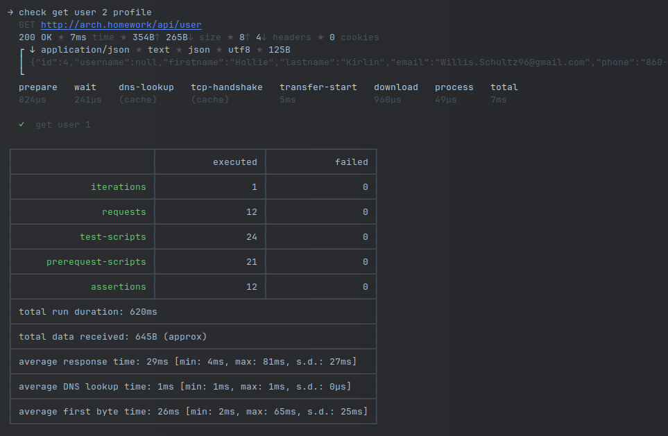

# Instruction
## Before installation
Install minikube, start minikube, ingress addon should be enabled


## Installation
### Install in the following order
1. install postgres database
    ```shell
    helm upgrade --install database -f postgres/values.yaml oci://registry-1.docker.io/bitnamicharts/postgresql  --create-namespace -n development
    ```
2. create database, user and password for application need install job
    ```shell
    helm install user-db ./user-db -n development
    ```
    ```shell
    helm install auth-db ./auth-db -n development
    ```
3. install apps
    ```shell
    helm upgrade --install user-service ./user-service -n development
    ```
    ```shell
    helm upgrade --install auth-service ./auth-service -n development
    ```
## Tests
Run postman collections 
```shell
newman run --verbose arch.homework.postman_collection.json
```




## Uninstall
* uninstall apps
```shell
helm uninstall user-service -n development
```
```shell
helm uninstall auth-service -n development
```
* delete job
```shell
helm uninstall user-db -n development
```
```shell
helm uninstall auth-db -n development
```
* uninstall postgres database
```shell
helm delete database -n development
```
```shell
#Delete PVC's associated with database
kubectl delete pvc data-database-postgresql-0  -n development
```
